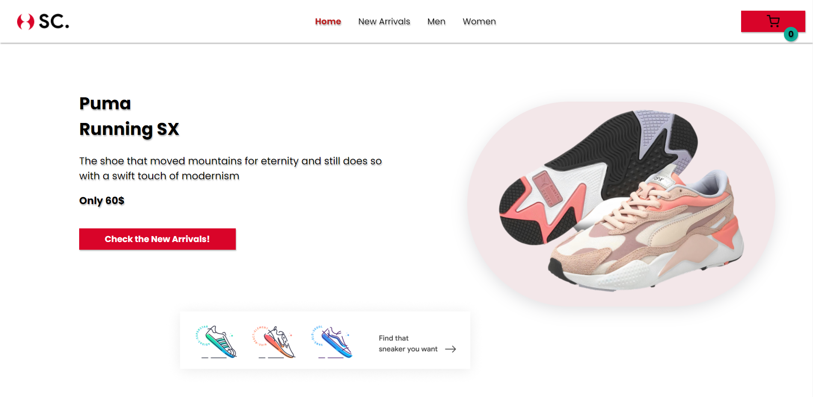

<h1 align="center">Sneakers store project</h1>

**`This project is an online sports footwear store developed using React.js. The main objective of the project was to create a web application that allows users to browse through a variety of sports footwear, add items to their cart, and make orders.`**  
**`The project encompasses the following functionalities:`**  
**`1.Navigation: The application follows a multi-page structure with pages including "Home," "New Arrivals," "Men," "Women," and "Product Details." React Router is used for seamless navigation between pages.`** 
**`2.Shopping Cart: The project implements the functionality to add items to the shopping cart. React Context API is employed to manage the cart state.`**  
**`3.Modal Window: A modal window is utilized to display the cart content upon button press. The modal window is implemented using portals.`**  
**`4.Product Details: Each product is associated with a dedicated detail page containing comprehensive information about the item. Users can also adjust the quantity of items on this page.`**  
**`5.Styling: CSS Modules are employed to style components, ensuring a responsive design for varying screen sizes.`**  
**`6.Brand Filtering: The project features a brand filtering functionality that allows users to filter sneakers based on different brands. This filtering feature enhances the user experience by enabling quick and efficient product searches.`**  

<h1 align="center">Technologies</h1>

**`JavaScript`**  
**`React.js(JSX)`** 
**`CSS`**

<h1 align="center">To do</h1>

- [x] Make a header
- [x] Make a home page
- [x] Make a Men, Women and New arrivals section
- [x] Update design in sections
- [x] Added filtering by brand
- [x] Added a React Router
- [x] Added a product page
- [x] Make a cart
- [x] Added a modal window
- [x] Make a cart functionality
- [ ] Upgrade a product page
- [ ] Make responsive design
- [ ] Optimize code

<h1 align="center">Screenshots</h1>
    
